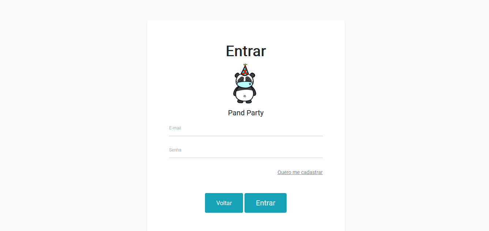

<h1 align='center'>
   
   <p>PandParty, sua festa online!</p>
</h1>

### O que é o PandParty?
PandParty é um aplicativo que foi criado para resolver um problema: a falta de socialização durante o período da pandemia, e como decidimos resolver tal problema?
Sentimos que a maior parte das pessoas nesse período de pandemia estava sentindo muita falta dos encontros com os amigos, festas, e mais, por isso, decidimos trazer
essa socialização para o mundo virtual, conectando as pessoas por meio de uma festa online, onde as pessoas poderiam se conectar e conversar com seus amigos, assistir 
filmes juntos por meio do compartilhamento de tela e muito mais, sempre visando trazer de volta a socialização perdida no meio da pandemia, porém mantendo as recomendações
de não sair de casa, contribuíndo para a saúde do país.

### Demonstração
 </br>
 </br>
 </br>


### Pré-requisitos
Antes de começar, você precisará ter instalado em sua máquina as seguintes ferramentas:
[Git](https://git-scm.com) e [XAMPP](https://www.apachefriends.org/pt_br/download.html).

### Rodando o site
    
  ```bash
  # Clone este repositório
  $ git clone https://github.com/enzovga/PandParty.git
  ```
  
Inicie o XAMPP e inicie o módulo "Apache", após isso se conecte a URL http://localhost, para iniciar o servidor local.

### Ferramentas Utilizadas
- HTML
- CSS
- JS
- PHP
- MySQL
- Bootstrap
- [PeerJS](https://peerjs.com/)
